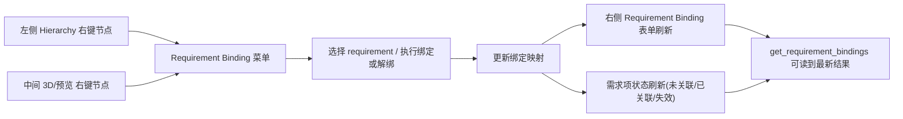

# Lookin 内嵌 MCP Server 产品需求文档（PRD）

## 1. 文档目的

定义在 Fork 后的 Lookin macOS 客户端中内嵌 MCP Server 的产品需求，确保后续技术方案可以直接据此完成系统设计、开发分工和验收。

## 2. 背景与问题

在 iOS UI 改动场景中，Coding Agent（如 Codex CLI、Claude Code）缺少以下关键上下文：

- 当前页面真实视图层级与选中节点
- 视图所属类及代码语义线索（如 owner、属性路径）
- 约束、样式、文本等可定位信息
- 选中目标截图证据
- 开发者“这个需求对应哪个视图”的显式意图

结果是 Agent 常出现定位偏差、修改错误文件、需要多轮纠正。Lookin 已具备调试态图层树/属性/截图能力，但尚不能通过 MCP Tool 直接提供给 Agent。

## 3. 产品目标与成功指标

### 3.1 产品目标

- 让工程师在 Lookin 中“选中一个视图”后，Agent 能通过 MCP 直接获取可执行的结构化上下文。
- 让工程师可以把“自然语言需求描述”与“具体视图节点”建立映射，供 Agent 精准落码。
- 让 Agent 可以按选中视图获取截图证据，减少语义歧义。

### 3.2 成功指标（上线后 1-2 个迭代观察）

- 上下文拉取成功率 >= 99%（按 Tool 调用统计）。
- 单次上下文查询 P95 响应时间 <= 2s（不含首次连接）。
- 使用该能力的需求中，Agent 首轮改动命中目标视图/文件的比例提升（目标：相对基线提升 >= 30%）。
- 需求关联映射（自然语言 -> 视图）中，已完成关联项占比 >= 90%（在实际使用会话内）。

## 4. 目标用户与核心场景

### 4.1 目标用户

- 使用 Coding Agent 进行 iOS 开发的工程师（主要）。
- 参与 UI 修改评审/联调的工程师（次要）。

### 4.2 核心场景

- 场景 A：工程师在 Lookin 选中待修改控件，让 Agent 读取结构化视图信息后改代码。
- 场景 B：工程师把 PRD 中的自然语言需求项逐条绑定到真实视图，Agent 按绑定结果实施修改。
- 场景 C：工程师让 Agent 获取选中视图截图，用于确认修改对象和改动前状态。

## 5. 范围定义

### 5.1 In Scope（本期必须）

- Lookin macOS 客户端内嵌 MCP Server。
- 暴露 P0 Tool：获取选中视图信息、需求项关联、获取选中视图截图。
- 在 Lookin 内提供“需求项列表 + 手动关联”基础交互。
- 在 Lookin 内支持用户直接编辑 `bindings` 文本内容。
- 提供稳定的数据结构与错误码，供 Agent 可预测调用。

### 5.2 Out of Scope（本期不做）

- Agent 自动识别并自动绑定视图（全自动映射）。
- 自动修改代码并回写 IDE（仅提供上下文，不直接改代码）。
- 脱离 Lookin 的独立桌面端工具。
- Android/Web 等非 iOS 目标平台支持。
- SwiftUI 视图支持（当前 Lookin 能力不覆盖，本期不做）。

## 6. 关键术语

- `选中视图`：用户当前在 Lookin 中高亮/选中的节点。
- `视图节点 ID`：在当前调试会话中唯一标识某个视图节点的 ID。
- `需求项`：来自 PRD/任务描述的自然语言条目（如“首页右上角搜索按钮”）。
- `关联映射`：需求项与视图节点的一对一或一对多关系。
- `会话`：一次 Lookin 连接目标 App 并持续交互的上下文周期。

## 7. 用户流程

### 7.1 流程 A：获取选中视图上下文

1. 工程师在 Lookin 中选中目标视图。
2. Agent 调用 MCP Tool 获取选中视图结构化信息。
3. Agent 基于返回信息定位到工程代码并执行改动。

### 7.2 流程 B：自然语言需求关联

1. Agent 将需求项列表提交给 MCP Server。
2. Lookin 展示待关联需求项清单（状态：未关联/已关联）。
3. 工程师在 Lookin 中选中节点并执行“关联到某需求项”。
4. Agent 拉取关联映射并据此执行定向开发。

### 7.3 流程 C：获取选中视图截图

1. 工程师在 Lookin 中选中目标视图。
2. Agent 调用截图 Tool。
3. MCP 返回截图文件路径，供 Agent 用于确认上下文。

## 8. 功能需求（Functional Requirements）

### FR-1 获取选中视图信息（P0）

**用户故事**  
作为 iOS 工程师，我希望 Agent 能拿到我在 Lookin 里选中的视图信息，以便精准修改代码。

**数据来源原则（必须）**

- FR-1 默认返回 iOS 应用运行时回传的数据（`LookinHierarchyInfo -> displayItems -> LookinDisplayItem`）。
- 允许返回客户端计算字段（如标题映射、统计值），但必须可由当前会话数据复算。
- 默认不返回纯 Lookin 面板交互态字段：`isExpanded`、`displayingInHierarchy`、`noPreview`、`inNoPreviewHierarchy`。

**输入**

- 无或可选参数（建议）：
  - `childrenDepth`（默认 `1`）

**输出字段（最小集）**

- `session`：
  - `sessionId`（建议基于 `appInfoIdentifier`）
  - `appName`、`appBundleIdentifier`
  - `timestamp`
- `selectedNode.identity`：
  - `nodeId`（规则：优先 `viewOid`，否则 `layerOid`）
  - `viewOid`、`layerOid`
- `selectedNode.iosRaw`：
  - `classChainList`、`rawClassName`、`memoryAddress`
  - `frame`、`bounds`
  - `isHidden`、`alpha`、`representedAsKeyWindow`
  - `hostViewControllerClassName`
  - `specialTrace`
  - `ivarTraces[]`（`relation`、`hostClassName`、`ivarName`）
- `selectedNode.dashboard`（核心）：
  - `groups[]`（与右侧 Dashboard 卡片结构同构）：
    - `groupIdentifier`、`groupTitle`、`isUserCustom`
    - `sections[]`：
      - `sectionIdentifier`、`sectionTitle`、`isUserCustom`
      - `attributes[]`（至少包含 `attrIdentifier`、`attrTitle`、`displayTitle`、`value`、`extraValue`）
- `selectedNode.structureHints`：
  - `parent`（至少：`nodeId`、`className`、`frame`）
  - `childrenSummary[]`（每项至少：`nodeId`、`className`、`frame`、`subitemCount`）

**字段说明（避免误导）**

- 本期不承诺 `accessibilityIdentifier`：当前代码链路未形成稳定输出字段。
- `ownerPropertyPath` 不作为必填字段，使用 `specialTrace + ivarTraces[]` 表达代码定位线索。
- `dashboard.groups[].sections[].attributes[]` 是 FR-1 主体；`parent/children` 是结构提示，不可替代属性上下文。
- 当节点为 `customInfo` 等不支持完整属性上下文的类型时，直接返回错误（`LOOKIN_MCP_BAD_ARGUMENT`），不返回部分成功。

**异常与边界**

- 未选中视图时返回明确错误（不可返回空成功）。
- 调试会话断开时返回可恢复错误并提示重连。
- 会话刷新导致原选中节点失效时，返回“未选中视图”并提示重新选择，不可降级为其他节点。

**验收标准**

- 在常见 UIKit 页面上，`selectedNode.iosRaw + selectedNode.dashboard` 可稳定解析并映射到当前选中节点。
- 同一次会话内重复调用，`nodeId/viewOid/layerOid` 语义稳定。
- `dashboard.groups[].sections[].attributes[]` 数量与当前选中节点属性数量一致。

### FR-2 自然语言需求关联（P0）

**用户故事**  
作为 iOS 工程师，我希望把自然语言需求项绑定到视图节点，让 Agent 明确“改哪里”。

**输入**

- Agent 通过 `set_requirement_items` 增删需求项：
  - `operation=append`：提交 `[{requirementId, description}]`
  - `operation=remove`：提交待删除的 `requirementId` 列表

**交互要求**

- Lookin 侧展示需求项列表和关联状态。
- 用户可将当前选中节点绑定到指定需求项。
- 支持取消绑定、重新绑定。
- 需求项与节点关系支持一对多（如“点赞按钮”可绑定 `DUXDiggButton`、`DUXDiggButtonLabel`、`DUXDiggButtonImage`）。
- 用户可在 Lookin 内直接编辑 `bindings` 文本，并参与映射返回。

**表单交互（在现有 UI 界面上新增）**

- 保持现有三栏布局不变（左：Hierarchy 树；中：3D/预览；右：Dashboard 属性面板）。
- 在右侧 Dashboard 面板新增 `Requirement Binding` 表单卡片（与 Class/Relation/Layout 同级卡片样式）。
- 在左侧 `Hierarchy` 树和中间 `3D/预览` 区域的右键菜单中，均新增 `Requirement Binding` 入口。
- 右键菜单行为：
  - 一级菜单：`Requirement Binding >`
  - 二级菜单：列出全部 requirement 项（显示 `requirementId` 与 `description` 摘要），点击后将“当前右键节点”绑定到对应 requirement。
  - 若当前节点已绑定某 requirement，菜单中显示 `Unbind from <requirementId-description>`。
  - 若 requirement 列表为空，`Requirement Binding` 菜单项置灰，并提示先调用 `set_requirement_items`。
- 表单字段：
  - `Requirement`：下拉选择（来自 `set_requirement_items`）。
  - `Description`：只读展示当前需求项描述。
  - `Bindings`：多行文本输入框（`String`，格式不限制）。
- 表单操作：
  - `添加自定义item`：允许用户手动添加Item，获取时可一并返回。
- 状态同步：
  - 右键菜单执行绑定/解绑后，右侧表单与需求项状态立即刷新。
  - 右侧表单执行绑定/解绑后，两个右键菜单的可用项与状态立即刷新。

**交互图（示意）**

**输出**

- Agent 可拉取完整映射：`[{requirementId, description, bindings}]`。
- `bindings` 类型为 `String`，内容格式不做限制（由调用方与客户端自行约定）。

**异常与边界**

- `requirementId` 重复时拒绝写入并报错。
- 节点失效（会话刷新后不存在）时由服务端在读取前清理，不额外暴露状态字段。
- `bindings` 允许为空字符串；为空时不阻塞绑定。

**验收标准**

- 10 条需求项内操作流畅、状态即时更新。
- Agent 获取映射字段固定为 `requirementId/description/bindings`，无额外状态字段。
- 用户更新 `bindings` 文本后，`get_requirement_bindings` 读取结果在 1s 内可见。
- 表单卡片在现有右侧 Dashboard 面板可稳定使用，不影响既有属性卡片交互与渲染性能。
- 左侧 `Hierarchy` 与中间 `3D/预览` 的右键菜单均可完成绑定/解绑，且与右侧表单状态一致。

### FR-3 获取选中视图截图（P0）

**用户故事**  
作为 iOS 工程师，我希望 Agent 获取选中视图截图，用于确认修改目标和上下文证据。

**输入**

- 可选参数：图片格式（默认 PNG）、是否高亮选中区域、缩放比例。

**输出**

- 截图文件路径和元数据（宽高、时间戳）。

**异常与边界**

- 选中节点不可见/截图失败时返回明确错误码。
- 截图失败不影响其他 Tool 正常调用。

**验收标准**

- 截图与当前选中节点一致，无明显错位。
- P95 截图耗时 <= 2s（常规页面）。

### FR-4 会话状态与一致性（P0）

**目标**

- 保证 Agent 明确知道自己读取的是哪次 Lookin 会话、哪一时刻的数据。

**要求**

- 所有 Tool 返回 `sessionId` 与 `timestamp`。
- 会话切换后，旧节点 ID 不可静默复用。
- 服务提供基础健康检查 Tool（供 Agent 判断是否可用）。

## 9. MCP Tool 能力清单（产品视角）

| Tool 名称（暂定） | 说明 | 优先级 |
| --- | --- | --- |
| `lookin.health` | 查询服务可用性与会话状态 | P0 |
| `lookin.get_selected_view_context` | 获取当前选中视图结构化信息 | P0 |
| `lookin.capture_selected_view_screenshot` | 获取当前选中视图截图 | P0 |
| `lookin.set_requirement_items` | 增删需求项（append/remove） | P0 |
| `lookin.get_requirement_bindings` | 拉取需求项与视图绑定映射 | P0 |

注：最终命名由技术方案确定，但能力边界需与上表一致。

## 9.1 协议规范遵循

- MCP 接口设计遵循 Anthropic 官方 MCP 规范（Tool 定义、参数 Schema、结构化返回、错误语义）。
- 若工程内部实现细节与规范存在冲突，以规范兼容性优先，避免影响主流 Agent 接入。

## 10. 非功能需求（NFR）

### 10.1 性能

- 普通上下文查询 P95 <= 2s。
- 需求映射读取 P95 <= 1s（<=100 条映射）。
- 不引入 Lookin 明显卡顿（主线程长阻塞不可接受）。

### 10.2 稳定性

- Tool 调用错误需有稳定错误码和可读错误信息。
- 单个 Tool 失败不应拖垮整个 MCP 服务。

### 10.3 安全与隐私

- 默认仅暴露当前会话必要数据，不主动上传外部服务。
- 截图与上下文数据仅在本地可控范围使用（默认会话内有效，可配置短期持久化）。

### 10.4 兼容性

- 覆盖团队当前主要开发环境（macOS + Xcode 主流版本）。
- 本期支持 UIKit，不支持 SwiftUI。

## 11. 工程约束

- Lookin macOS 客户端代码位于 `Lookin-Develop` 目录。
- MCP Server 为 Lookin 内嵌能力，不新增独立常驻进程。
- 需沿用现有工程语言栈与构建体系，避免引入高维护成本技术栈分叉。
- 截图 Tool 返回文件路径（本地路径）作为唯一交付形式。

## 12. 验收标准（整体）

- 功能验收：FR-1~FR-4 全部通过。
- 体验验收：工程师可在一次会话内完成“选中 -> 获取上下文 -> 建立映射 -> 获取截图”闭环。
- 稳定性验收：连续调用 100 次无崩溃、无不可恢复状态。
- 文档验收：对每个 Tool 的输入输出、错误码、示例返回均有规范文档（由技术方案阶段补齐）。

## 13. 里程碑建议

- `M1`（最小可用）：FR-1 + FR-3 + `lookin.health`
- `M2`（可落码）：FR-2 全链路（需求项提交、Lookin 关联、Agent 拉取映射）
- `M3`（可推广）：性能与错误码收敛、完整验收文档

## 14. 风险与缓解

- 视图节点与代码属性路径无法稳定映射：允许字段为空并标记可信度，避免误导 Agent。
- 调试会话频繁变更导致绑定失效：引入失效状态和重绑机制。
- 大页面数据量过大：限制默认返回深度并支持按需展开参数。

## 15. 已确认决策

- 需求项与节点关系允许一对多；并支持用户在 Lookin 客户端中直接编辑 `bindings` 文本。
- 截图返回形式固定为文件路径。
- 绑定数据生命周期为“默认会话内有效 + 可配置短期持久化”。
- 本期不支持 SwiftUI（受 Lookin 当前能力限制）。
- 暂无团队既有标准；MCP 接口规范参考 Anthropic 官方 MCP 标准。
