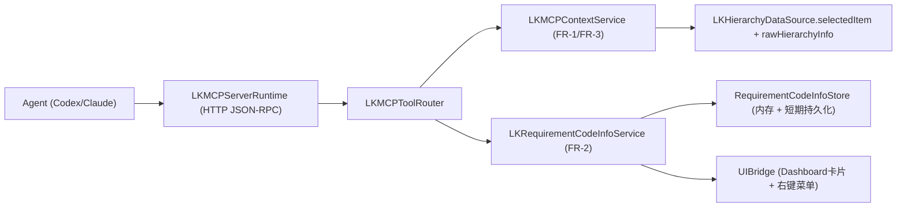

# Lookin-MCP 技术方案（V1）

## 1. 目标与范围

本方案用于将 `lookin-mcp/PRD.md` 落为可开发实现，覆盖 P0：

- `lookin.health`
- `lookin.get_selected_view_context`
- `lookin.set_requirement_items`
- `lookin.get_requirement_code_info`
- `lookin.capture_selected_view_screenshot`

并满足：

- 数据源以 iOS 运行时回传为主。
- `codeInfo` 类型为 `String`，内容格式不限制。
- `codeInfo` 数据默认会话内有效，支持可配置短期持久化。
- UIKit only（不支持 SwiftUI）。

## 2. 现状基线（代码挂载点）

现有代码可直接复用的关键链路：

- 选中节点与层级数据：
  - `Lookin-Develop/LookinClient/Hierarchy/LKHierarchyDataSource.m`
  - `Lookin-Develop/Pods/LookinShared/Src/Main/Shared/LookinHierarchyInfo.h`
  - `Lookin-Develop/Pods/LookinShared/Src/Main/Shared/LookinDisplayItem.h`
- 右键菜单入口：
  - 左侧树：`Lookin-Develop/LookinClient/Hierarchy/LKHierarchyView.m` (`menuNeedsUpdate`)
  - 中间预览：`Lookin-Develop/LookinClient/Static/Preview/LKPreviewController.m` (`menuNeedsUpdate`)
- 右侧 Dashboard 卡片渲染：
  - `Lookin-Develop/LookinClient/Dashboard/LKDashboardViewController.m`
  - `Lookin-Develop/LookinClient/Dashboard/LKDashboardSectionView.m`
  - `Lookin-Develop/Pods/LookinShared/Src/Main/Shared/LookinDashboardBlueprint.m`
- 截图导出能力：
  - `Lookin-Develop/LookinClient/Export/LKExportManager.m`

## 3. 总体架构

采用“应用内嵌 MCP Server（本地回环地址）+ Tool 路由 + UI/状态桥接”的分层。

### 3.1 模块划分

- `LKMCPServerRuntime`
  - 职责：启动/停止本地 MCP 服务、处理 JSON-RPC 协议、统一鉴权与错误包装。
  - 生命周期：随 App 启动初始化，随 App 退出释放。
- `LKMCPToolRouter`
  - 职责：方法分发、参数校验、输出 schema 校验、错误码映射。
- `LKMCPContextService`
  - 职责：组装 `get_selected_view_context` 与截图输出。
- `LKRequirementCodeInfoService`
  - 职责：管理 requirement 列表、`codeInfo` 持久化与状态同步。
- `RequirementCodeInfoStore`
  - 职责：会话内状态 + `NSUserDefaults` 短期持久化（可配置 TTL）。
- `UIBridge`
  - 职责：向左树/中预览注入 `Code Info` 菜单，并提供全局 `Code Info` 看板入口。

### 3.2 传输协议选择（为何 Streamable HTTP 而非 stdio）

本期默认采用 `Streamable HTTP`，不采用 `stdio`，理由如下：

- 部署形态匹配：当前方案是“Lookin GUI 应用内嵌 MCP Server”，`HTTP` 更适合被外部 Agent 直接连接。
- 避免新增桥接进程：`stdio` 通常要求由 MCP Client 启动并托管子进程；若用于 GUI App，通常还需额外 CLI 桥接层，违背“本期不新增独立常驻进程”的约束。
- 会话交互更自然：Lookin 可长期保持运行，Agent 随时连接/断开并发起 Tool 调用，符合“先在 Lookin 选中，再由 Agent 拉取上下文”的流程。
- 并发与重连更直接：多次调用、重试、超时控制、并发访问在 HTTP 语义下更清晰。

对应约束与防护：

- 仅监听 `127.0.0.1`。
- 启动时生成进程级随机 token 做本地鉴权。
- 端口冲突时自动换端口并在 `lookin.health` 返回当前可用地址元信息（后续实现）。

## 4. 会话与数据模型

### 4.1 会话模型

- `sessionId`：`appInfo.appInfoIdentifier`（字符串化）。
- `sessionTimestamp`：服务端生成（毫秒时间戳）。
- 会话切换判定：`LKAppsManager.inspectingApp` 变化或 `appInfoIdentifier` 变化时触发。

### 4.2 Requirement Code Info 模型

- `RequirementItem`
  - `requirementId: String`（唯一）
  - `description: String`
- `RequirementCodeInfoRecord`
  - `requirementId`
  - `description`
  - `codeInfo: String`（对外返回字段）

说明：`codeInfo` 固定为 `String`，不限制格式；由调用方/LLM 自行解释。
不设官方格式约束，不定义固定模板（如 JSON schema）；由调用方/LLM 自行解释该字符串内容。

## 5. Tool 设计

### 5.1 `lookin.health`（低复杂度保留）

- 目标：仅提供最小可用探针，不承载业务逻辑。
- 返回（固定最小字段）：`{status, sessionId, appName, appBundleIdentifier, timestamp}`
- `status` 取值：
  - `ok`：MCP 运行中且存在可用会话
  - `no_session`：MCP 运行中但当前无可用调试会话
- 约束：
  - 不访问重数据结构（不遍历 hierarchy，不读取 attributes）。
  - 不引入额外线程池、缓存层或持久化逻辑。
- 用途：Agent 调用业务 Tool 前先做连通性与会话预检。

### 5.2 `lookin.get_selected_view_context`

- 数据源：
  - `rawHierarchyInfo + selectedItem + attributesGroupList/customAttrGroupList`
  - 客户端可复算字段：`nodeId` 规则、标题映射
- nodeId 规则：
  - 优先 `selectedItem.viewObject.oid`
  - 否则 `selectedItem.layerObject.oid`
- 返回约束：
  - 不返回 `quality` 字段，响应保持最小实体。
  - 成功响应必须包含可用的 `dashboard.groups[].sections[].attributes[]`。
  - 当选中 `customInfo` 等不支持完整属性上下文的节点时，直接返回 `LOOKIN_MCP_BAD_ARGUMENT`。

#### FR-1 字段映射（核心）

- `session.appName/appBundleIdentifier` <- `rawHierarchyInfo.appInfo`
- `selectedNode.identity.viewOid/layerOid` <- `selectedItem.viewObject.oid / layerObject.oid`
- `selectedNode.iosRaw.classChainList/memoryAddress/specialTrace/ivarTraces` <- `LookinObject`
- `selectedNode.iosRaw.frame/bounds/isHidden/alpha/representedAsKeyWindow` <- `LookinDisplayItem`
- `selectedNode.dashboard.groups[].sections[].attributes[]` <- `selectedItem.queryAllAttrGroupList` 原始层级
- `groupTitle/sectionTitle/displayTitle` <- `LookinDashboardBlueprint` 与 `LookinAttributesGroup+LookinClient`
- `selectedNode.structureHints.parent/childrenSummary` <- `superItem/subitems`（结构提示，非主数据）

默认不返回纯客户端交互态字段：`isExpanded/displayingInHierarchy/noPreview/inNoPreviewHierarchy`。

### 5.3 `lookin.set_requirement_items`

- 输入：
  - `operation=append` + `[{requirementId, description}]`
  - `operation=remove` + `[{requirementId}]`
- 校验：
  - `append` 时要求 `description` 必填。
  - `remove` 时按 `requirementId` 删除，不接受不存在 ID。
  - 同请求内 `requirementId` 不可重复。
- 结果：更新内存 store，并广播 UI 刷新事件。

### 5.4 `lookin.get_requirement_code_info`

- 输出：`[{requirementId, description, codeInfo}]`
- `codeInfo` 为 `String`，格式不限制（不做模板约束，交由 LLM 自行理解）。
- 读取时直接返回当前会话下的 requirement 数据，不做节点关联态推断。

### 5.5 `lookin.capture_selected_view_screenshot`

- 默认使用 `selectedItem.groupScreenshot`。
- 文件落地目录：`~/Library/Caches/com.lookin.client/mcp-screenshots/`
- 返回：`{path, width, height, timestamp, sessionId, nodeId}`
- 不弹保存面板（与 `LKExportManager exportScreenshotWithDisplayItem` 区分）。

## 6. FR-2 UI 设计

### 6.1 右侧表单卡片（Dashboard）

- 新增 Group：`Requirement`
- 新增独立窗口：`Code Info Items`
- 字段：
  - `Requirement ID`（只读）
  - `Description`（可编辑）
  - `Code Info`（多行文本，`String`）
- 操作：
  - `Add`
  - `Delete`
  - `Reload`

实现路径：

- 基于 `LKRequirementCodeInfoStore` 新增并维护独立看板控制器。
- 在右键菜单中提供看板打开入口。

### 6.2 左树/中预览右键菜单

- 左树：`LKHierarchyView.menuNeedsUpdate` 增加一级菜单 `Code Info >`
- 中预览：`LKPreviewController.menuNeedsUpdate` 同步增加
- 子菜单内容：
  - `Open Code Info Board…`
  - requirement 列表（只读展示 `requirementId - description`）
  - 无 requirement 时置灰并提示先调用 `set_requirement_items`

### 6.3 状态一致性

- 新增通知：`NotificationName_RequirementCodeInfoDidChange`
- 触发点：Tool 写入、看板编辑
- 订阅者：左树菜单、中预览菜单、Code Info 看板

## 7. 持久化策略

- 默认：仅会话内内存态。
- 可配置：短期持久化（默认 `24h`）。
- TTL 档位：`仅会话内 / 1h / 24h / 72h`。
- 配置入口：`Preference` 页（M2 先实现常量 + UserDefaults 配置，M3 补可视化设置入口）。
- 持久化键建议放入 `LKPreferenceManager`：
  - `mcp_requirement_code_info_payload`
  - `mcp_requirement_code_info_expire_at`
  - `mcp_requirement_code_info_ttl_mode`
- 会话变化时：
  - 同 appInfoIdentifier：可恢复
  - 不同 appInfoIdentifier：标记为失效，不自动复用

## 8. 错误码（建议）

- `LOOKIN_MCP_NO_SESSION`：当前无可用调试会话
- `LOOKIN_MCP_NO_SELECTION`：当前未选中视图
- `LOOKIN_MCP_DUP_REQUIREMENT_ID`：`requirementId` 重复
- `LOOKIN_MCP_REQUIREMENT_NOT_FOUND`：目标 requirement 不存在（如 `operation=remove` 指定不存在的 `requirementId`）
- `LOOKIN_MCP_SCREENSHOT_FAILED`：截图写盘失败
- `LOOKIN_MCP_BAD_ARGUMENT`：参数不合法
  - 含义扩展：也用于“当前选中节点不支持完整属性上下文（如 customInfo）”

## 9. 线程与性能

- Tool 入口在 MCP I/O 线程执行；读写 UI 状态通过 `dispatch_async(dispatch_get_main_queue(), ...)` 包装。
- `get_selected_view_context` P95 < 2s：
  - 默认 `childrenDepth=1`
  - attributes 展平采用惰性映射
- `get_requirement_code_info` P95 < 1s：
  - 主要开销为内存/本地持久化读取与 JSON 序列化

## 10. 安全与边界

- MCP 仅监听 `127.0.0.1`，禁止外网网卡绑定。
- 增加启动随机 token（进程级）用于本地调用鉴权。
- 文件输出仅落在 Lookin 缓存目录，不写任意路径。
- 不上传任何截图与上下文到外部服务。

## 11. 开发拆解（里程碑）

### M1（FR-1 + FR-3 + health）

- 新增 `LKMCPServerRuntime`、`LKMCPToolRouter`、`LKMCPContextService`
- 打通 `health/context/screenshot`

### M2（FR-2 全链路）

- 新增 `LKRequirementCodeInfoService` + `RequirementCodeInfoStore`
- 完成右侧卡片 + 左/中右键菜单联动
- 打通 `set(append/remove)/get code infos`
- 新增工具栏 MCP 状态指示（基础版）

### M3（收敛与验收）

- 错误码统一、性能压测、稳定性（100 次连续调用）
- 补齐 Tool 文档与示例响应

## 12. 待确认项（进入开发前）

当前无待确认项。

已定：`lookin.health` 保留，且保持低复杂度最小实现。
已定：MCP 传输采用 `Streamable HTTP`（本地回环地址），本期不采用 `stdio`。
已定：`codeInfo` 仅要求 `String` 类型，不限制字符串格式，由 LLM 自行理解。
已定：短期持久化 TTL 默认 `24h`，支持 `仅会话内 / 1h / 24h / 72h`，配置入口放在 `Preference`（M2 先底层配置，M3 补 UI）。
已定：新增工具栏 MCP 状态指示，至少展示 `服务状态/端口/会话状态`（M2 基础展示，M3 增加错误细分与交互）。
